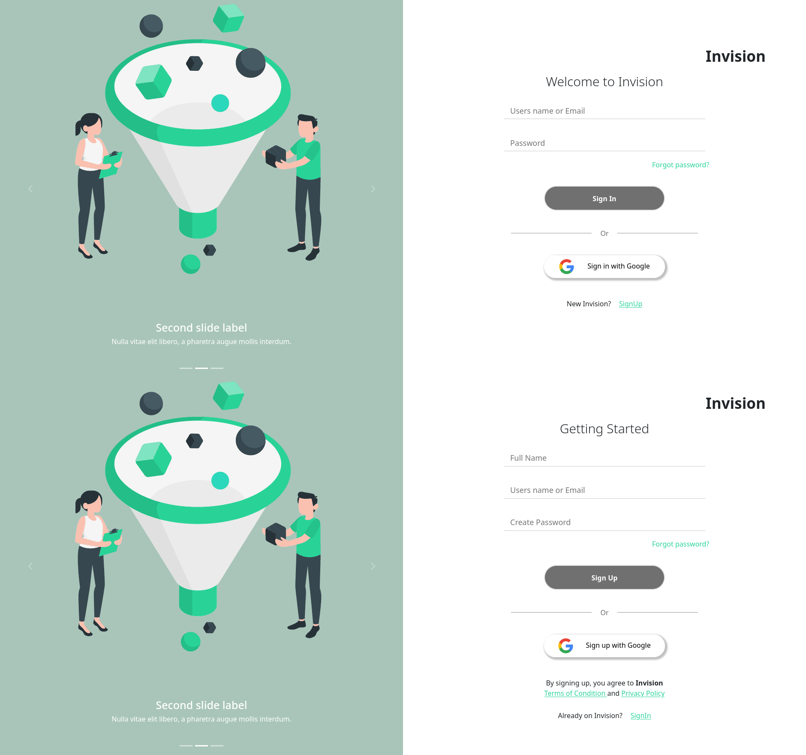
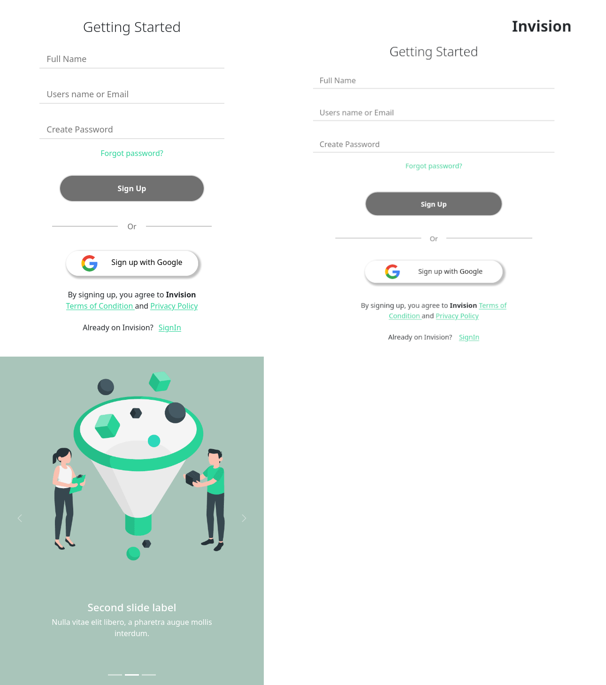

## About This Project

This is the project i made as a test for a selection process in a company here in Caruaru-PE.
Basically i used ReactJS, React-Router-DOM and Bootstrap (for the Slideshow).

## Progress

- [x] SignIn and SignUp Screens
- [x] Use react-router-dom for navigation
- [x] Make the UI responsive for Computers, Notebooks, iPads and Smartphones
- [x] Email input only accepts Email values
- [x] SignIn with Google button
- [x] Slideshow runs automatically but the user can control if want it
- [x] All CSS values as variables
- [ ] Test Components with React Testing Library
- [ ] Password input field with minimum 6 characters length and change the input border color to red


## Getting Started

First, install NodeJS dependencies:

```bash
npm install
```

Then, just start the server:

```bash
npm start
```

Open [http://localhost:3000](http://localhost:3000) with your browser to see the result.




## Contact me
If you want to know more about me or the projects i'm working on you can contact me on allyson2308h@gmail.com. You can view more of my projects at https://github.com/all123all.